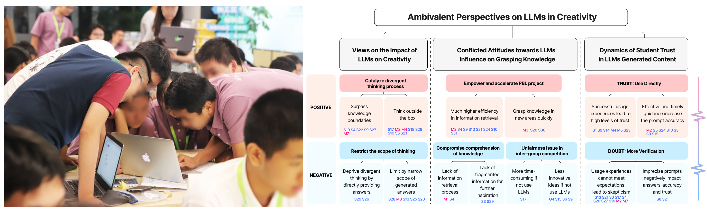

  
🧩 Overview

  

    This research explores how Large Language Models (LLMs), such as ChatGPT, can support middle school students’ creativity during project-based learning (PBL).
    Through an observational study and a week-long instructional experiment with 31 students, the study identified five design considerations and proposed a novel LLM-empowered PBL program.
    Results show that LLMs can support all phases of PBL—from idea discovery to final presentation—by boosting creative self-efficacy and providing personalized, real-time feedback.
    The study also discusses students’ ambivalent perceptions of LLMs and highlights design implications for integrating AI tools into educational settings.
  

  
📚 Publication

  

    Zha, S., Qiao, Y., Hu, Q., Li, Z., Gong, J., &amp; Xu, Y. (2025).
    Designing child-centric AI learning environments: Insights from an LLM-powered creative project-based learning study.
    International Journal of Human-Computer Studies, 103602.
    <a href="https://www.sciencedirect.com/science/article/abs/pii/S1071581925001594" target="_blank">https://doi.org/10.1016/j.ijhcs.2025.103602</a>
  

  
🎯 Contributions

  <ul class="tight-list">
    <li>Conducted user interviews and thematic analysis</li>
    <li>Co-designed the 48-hour instructional program</li>
    <li>Supported on-site study coordination and data collection</li>
    <li>Assisted in manuscript writing and figure design</li>
  </ul>

<!-- 直接在最底部插入图片（不使用卡片&无标题） -->

Classroom activity (left) and synthesized framework of ambivalent perspectives on LLMs in creativity (right).

